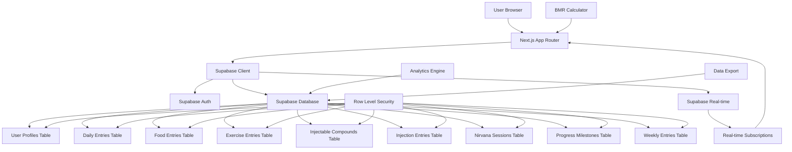
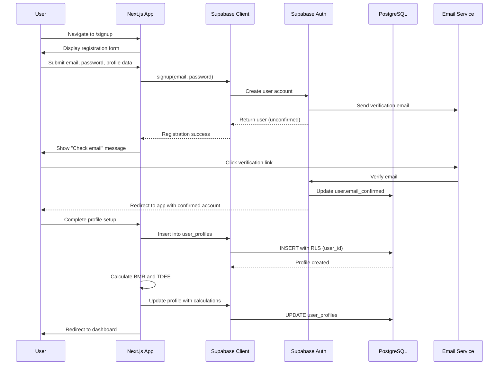
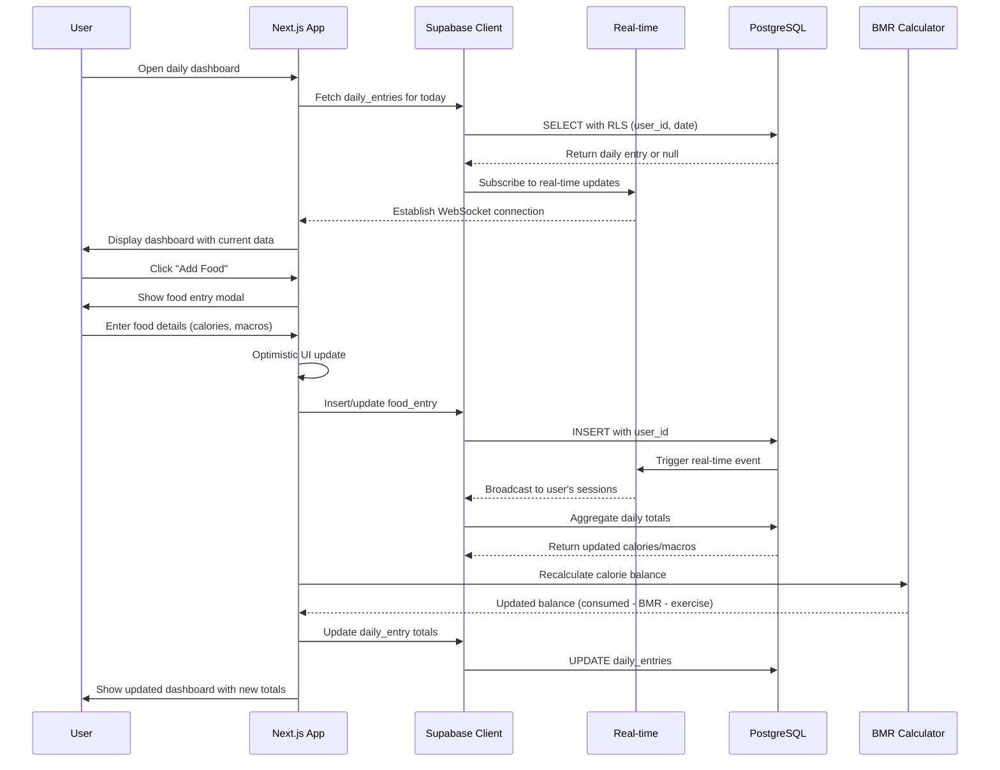

# MM Health Tracker Architecture Document

## Introduction

This document outlines the overall project architecture for **MM Health Tracker**, including backend systems, shared services, and non-UI specific concerns. Its primary goal is to serve as the guiding architectural blueprint for AI-driven development, ensuring consistency and adherence to chosen patterns and technologies.

**Relationship to Frontend Architecture:**
If the project includes a significant user interface, a separate Frontend Architecture Document will detail the frontend-specific design and MUST be used in conjunction with this document. Core technology stack choices documented herein (see "Tech Stack") are definitive for the entire project, including any frontend components.

### Starter Template or Existing Project

**Analysis of Current Codebase:**
Based on the PRD and examining the repository structure, this project is built on:

1. **Next.js 15.5+ Foundation**: The PRD specifies Next.js 15.5.3 with App Router as the core framework
2. **MM Design System Integration**: Custom design system at `design-system-cpn/` with Tailwind 4.0
3. **Existing Application Structure**: The `mm-health-tracker/` directory contains a functioning Next.js application
4. **TypeScript Configuration**: Strict TypeScript 5 setup with comprehensive type definitions

**Pre-configured Technology Stack:**
- Next.js 15.5.3 with App Router and React 19.1.0
- Tailwind CSS 4.0 with custom MM theme configuration
- TypeScript 5 in strict mode
- **CRITICAL CHANGE**: Migrating from localStorage to Supabase PostgreSQL database
- React Context + useReducer state management
- Recharts for data visualizations

**Architectural Decision:**
This project will **migrate away from localStorage** to a **Supabase-based architecture**, transforming from a client-side data storage model to a proper backend-as-a-service implementation with multi-tenant user accounts.

### Change Log

| Date | Version | Description | Author |
|------|---------|-------------|--------|
| 2025-09-28 | 1.0 | Initial architecture document creation | Architect |

## High Level Architecture

### Technical Summary

MM Health Tracker employs a **Supabase-powered, multi-tenant SaaS architecture** built on Next.js 15.5 with App Router. The system leverages Supabase's PostgreSQL database, real-time subscriptions, and built-in authentication to provide secure, isolated user accounts with comprehensive health tracking capabilities. The architecture follows a **database-per-tenant isolation model** using Row Level Security (RLS) policies, ensuring complete data separation between users while maintaining performance through efficient indexing and real-time synchronization.

### High Level Overview

**Primary Architectural Style**: **Backend-as-a-Service (BaaS) with Multi-Tenant Isolation**

**Repository Structure**: Monorepo (maintained from PRD)
- `mm-health-tracker/` - Next.js application with Supabase integration
- `design-system-cpn/` - Shared UI components and styling
- `supabase/` - Database migrations, RLS policies, and functions

**Service Architecture**: **Supabase-Centric Serverless**
- Supabase handles authentication, database, real-time, and storage
- Next.js API routes for business logic and data validation
- Client-side state management with Supabase real-time subscriptions

**User Interaction Flow**:
1. **Authentication**: User registration/login via Supabase Auth
2. **Data Entry**: Real-time data synchronization with immediate UI feedback
3. **Analytics**: Server-side aggregations with client-side visualizations
4. **Multi-Device**: Seamless sync across devices via Supabase real-time

**Key Architectural Decisions**:
- **Data Isolation**: Row Level Security (RLS) ensures complete user data separation
- **Real-time Updates**: Supabase subscriptions for live data synchronization
- **Authentication**: Supabase Auth with email/password and social providers
- **Offline Support**: Progressive enhancement with local caching strategies

### High Level Project Diagram



### Architectural and Design Patterns

**Data Isolation Pattern**: **Row Level Security (RLS) Multi-Tenancy**
- Every table includes `user_id` foreign key to `auth.users`
- RLS policies ensure users can only access their own data
- Database-level security prevents data leakage
- _Rationale:_ Provides strongest security guarantee while maintaining performance

**Authentication Pattern**: **Supabase Auth with JWT**
- Built-in user management with email verification
- Social provider integration (Google, GitHub)
- Automatic JWT token management
- _Rationale:_ Eliminates complex auth implementation while providing enterprise-grade security

**State Management Pattern**: **Supabase Client + React Context**
- Supabase client for database operations and real-time subscriptions
- React Context for global user state and current session data
- Local state for UI-specific data (forms, loading states)
- _Rationale:_ Balances real-time capabilities with familiar React patterns

**Data Synchronization Pattern**: **Real-time Subscriptions with Optimistic Updates**
- Real-time subscriptions for live data updates across devices
- Optimistic UI updates for immediate feedback
- Conflict resolution through database timestamps
- _Rationale:_ Provides instant UI feedback while maintaining data consistency

**Migration Pattern**: **Feature-by-Feature Migration from localStorage**
- Parallel data layers during transition period
- Feature flags to switch between localStorage and Supabase
- Data migration utilities for existing users
- _Rationale:_ Minimizes risk and allows gradual rollout

**Security Pattern**: **Defense in Depth**
- Database RLS policies as primary security layer
- API route validation as secondary protection
- Client-side validation for UX (not security)
- _Rationale:_ Multiple security layers prevent data breaches even if one layer fails

## Tech Stack

### Cloud Infrastructure

- **Provider:** Supabase (Backend-as-a-Service)
- **Key Services:** PostgreSQL Database, Authentication, Real-time, Storage, Edge Functions
- **Deployment Regions:** Auto-managed by Supabase with global edge network

### Technology Stack Table

| Category | Technology | Version | Purpose | Rationale |
|----------|------------|---------|---------|-----------|
| **Database** | Supabase PostgreSQL | 15+ | Primary data store with RLS | Built-in multi-tenancy, real-time, ACID compliance |
| **Backend Service** | Supabase | Latest | BaaS platform | Eliminates backend infrastructure, provides auth + real-time |
| **Language** | TypeScript | 5.3+ | Primary development language | Type safety, excellent Supabase SDK support |
| **Runtime** | Node.js | 20.11.0 LTS | JavaScript runtime | Stable LTS, optimal Next.js performance |
| **Framework** | Next.js | 15.5.3 | Full-stack React framework | App Router, API routes, excellent Supabase integration |
| **Frontend** | React | 19.1.0 | UI framework | Server Components, Suspense, concurrent features |
| **Authentication** | Supabase Auth | Latest | User management & JWT | Built-in email/social auth, RLS integration |
| **Real-time** | Supabase Realtime | Latest | Live data synchronization | WebSocket-based, automatic subscriptions |
| **State Management** | React Context + Supabase | Built-in | Global state & DB sync | Leverages Supabase client state, minimal complexity |
| **Styling** | Tailwind CSS | 4.0 | Utility-first CSS | MM Design System integration, rapid development |
| **Data Visualization** | Recharts | 2.8+ | Charts and analytics | React-native, excellent TypeScript support |
| **Date Handling** | date-fns | 3.0+ | Date manipulation | Lightweight, YYYY-MM-DD format consistency |
| **Validation** | Zod | 3.22+ | Schema validation | TypeScript-first, client/server validation |
| **Testing** | Vitest | 1.0+ | Unit testing framework | Fast, ESM-native, excellent TypeScript support |
| **E2E Testing** | Playwright | 1.40+ | End-to-end testing | Multi-browser, reliable, good Supabase integration |
| **Linting** | ESLint | 8.56+ | Code quality | TypeScript support, Next.js rules |
| **Formatting** | Prettier | 3.0+ | Code formatting | Consistent style, team productivity |
| **Package Manager** | npm | 10.2+ | Dependency management | Built-in Node.js, workspaces support |
| **Deployment** | Vercel | Latest | Frontend hosting | Optimal Next.js integration, preview environments |
| **Environment** | Supabase CLI | Latest | Local development | Database migrations, type generation |

## Data Models

### Core Multi-Tenant Design Principles

**User Isolation Strategy:**
- Every table references `auth.users.id` for Row Level Security
- Foreign key constraints ensure referential integrity
- Database-level security prevents cross-user data access
- Composite indexes optimize user-scoped queries

**Data Relationships:**
- User Profile (1:1 with auth.users)
- Daily Entries (1:many per user, date-keyed)
- Food/Exercise Entries (many:1 with Daily Entries)
- Injectable Compounds (many:1 with user, 1:many with injections)
- Training Sessions (many:1 with user)
- Weekly Objectives (many:1 with user, week-keyed)

### User Profile

**Purpose:** Central user configuration and calculated health metrics

**Key Attributes:**
- `id`: UUID (Primary Key, references auth.users.id)
- `name`: Text - Display name
- `email`: Text - Contact email (synced from auth.users)
- `age`: Integer - Current age for BMR calculations
- `gender`: Enum('male', 'female', 'other') - BMR calculation factor
- `height_cm`: Integer - Height in centimeters
- `current_weight_kg`: Decimal(5,2) - Most recent weight
- `activity_level`: Enum('sedentary', 'lightly_active', 'moderately_active', 'very_active', 'extremely_active')
- `bmr`: Integer - Calculated Basal Metabolic Rate
- `tdee`: Integer - Total Daily Energy Expenditure
- `calorie_target`: Integer - Daily calorie goal
- `protein_target_g`: Integer - Daily protein goal in grams
- `carbs_target_g`: Integer - Daily carbohydrates goal in grams
- `fats_target_g`: Integer - Daily fats goal in grams
- `units`: Enum('metric', 'imperial') - Preferred measurement system
- `created_at`: Timestamptz - Profile creation
- `updated_at`: Timestamptz - Last modification

**Relationships:**
- References `auth.users.id` (1:1)
- Referenced by all user-scoped tables

### Daily Entries

**Purpose:** Daily health tracking data aggregated by date

**Key Attributes:**
- `id`: UUID (Primary Key)
- `user_id`: UUID (Foreign Key to auth.users.id)
- `date`: Date - Tracking date (YYYY-MM-DD)
- `weight_kg`: Decimal(5,2) - Daily weight measurement
- `calories_consumed`: Integer - Total calories eaten
- `calories_burned_exercise`: Integer - Exercise calorie burn
- `calories_burned_bmr`: Integer - BMR calories for the day
- `calorie_balance`: Integer - Calculated: consumed - (bmr + exercise)
- `protein_consumed_g`: Integer - Total protein consumed
- `carbs_consumed_g`: Integer - Total carbohydrates consumed
- `fats_consumed_g`: Integer - Total fats consumed
- `mit_task_1`: Text - Most Important Task 1
- `mit_task_1_completed`: Boolean - Task 1 completion
- `mit_task_2`: Text - Most Important Task 2
- `mit_task_2_completed`: Boolean - Task 2 completion
- `mit_task_3`: Text - Most Important Task 3
- `mit_task_3_completed`: Boolean - Task 3 completion
- `deep_work_completed`: Boolean - Deep work session completed
- `notes`: Text - Daily notes
- `created_at`: Timestamptz - Entry creation
- `updated_at`: Timestamptz - Last modification

**Relationships:**
- References `users.id` (many:1)
- Referenced by `food_entries` (1:many)
- Referenced by `exercise_entries` (1:many)
- Unique constraint on `(user_id, date)`

## Components

### Authentication Service

**Responsibility:** User registration, authentication, session management, and security enforcement

**Key Interfaces:**
- `POST /auth/signup` - User registration with email verification
- `POST /auth/signin` - User authentication with JWT token generation
- `POST /auth/signout` - Session termination and token invalidation
- `GET /auth/user` - Current user profile and session status
- `POST /auth/reset-password` - Password reset workflow

**Dependencies:** Supabase Auth, Next.js API routes for validation

**Technology Stack:** Supabase Auth SDK, Next.js middleware for route protection, Zod for input validation

### Health Data Service

**Responsibility:** Core health metrics management including BMR calculations, daily entries, and nutritional tracking

**Key Interfaces:**
- `GET /api/health/profile` - User health profile and BMR data
- `PUT /api/health/profile` - Update profile and recalculate BMR
- `GET /api/health/daily/:date` - Daily health entry for specific date
- `POST /api/health/daily` - Create/update daily health entry
- `GET /api/health/trends` - Historical health data with aggregations
- `POST /api/health/calculate-bmr` - BMR calculation endpoint

**Dependencies:** User Profile, Daily Entries, Food Entries, Exercise Entries tables

**Technology Stack:** Supabase client with RLS policies, Next.js API routes, BMR calculation algorithms

### Medical Protocol Service

**Responsibility:** Injectable compound management, injection tracking, and dosage calculations

**Key Interfaces:**
- `GET /api/medical/compounds` - User compound library
- `POST /api/medical/compounds` - Add injectable compound
- `POST /api/medical/injection` - Log injection
- `GET /api/medical/injections` - Injection history
- `POST /api/medical/calculate-dose` - Dosage calculator
- `GET /api/medical/adherence` - Weekly adherence tracking

**Dependencies:** Injectable Compounds, Injection Entries tables

**Technology Stack:** Pharmaceutical calculation algorithms, site rotation logic, adherence tracking

## External APIs

### Supabase API

- **Purpose:** Primary backend-as-a-service providing database, authentication, real-time, and storage
- **Documentation:** https://supabase.com/docs
- **Base URL(s):**
  - `https://[project-ref].supabase.co` - Main API endpoint
  - `wss://[project-ref].supabase.co/realtime/v1` - Real-time WebSocket
- **Authentication:** API Key + JWT tokens (handled by Supabase client)
- **Rate Limits:**
  - Database: 500 requests/second (can be increased)
  - Auth: 30 requests/minute per IP for auth endpoints
  - Real-time: 100 concurrent connections (scalable)

**Key Endpoints Used:**
- `POST /auth/v1/signup` - User registration
- `POST /auth/v1/token` - Authentication and token refresh
- `GET /rest/v1/[table]` - Database queries with RLS
- `POST /rest/v1/[table]` - Database inserts/updates
- `WebSocket /realtime/v1` - Real-time subscriptions

**Integration Notes:** All database operations go through Supabase's PostgREST API with automatic Row Level Security enforcement. Real-time subscriptions provide multi-device synchronization without additional infrastructure.

## Core Workflows

### User Registration and Onboarding Workflow



### Daily Health Entry Workflow



## REST API Spec

The MM Health Tracker includes a comprehensive REST API built on Next.js API routes that interface with Supabase. All endpoints enforce user authentication and data isolation through RLS policies.

### Authentication

All API endpoints require JWT authentication via Authorization header:
```
Authorization: Bearer <jwt_token>
```

### Core Endpoints

#### Health Profile
- `GET /api/health/profile` - Get user health profile
- `PUT /api/health/profile` - Update user health profile

#### Daily Entries
- `GET /api/health/daily/{date}` - Get daily health entry
- `PUT /api/health/daily/{date}` - Create or update daily entry

#### Food Entries
- `POST /api/nutrition/food-entries` - Log food consumption
- `GET /api/nutrition/food-entries` - Get food entries for date range
- `DELETE /api/nutrition/food-entries/{id}` - Delete food entry

#### Exercise Entries
- `POST /api/exercise/entries` - Log exercise session
- `POST /api/exercise/calculate-calories` - Calculate exercise calorie burn

#### Medical Protocol
- `GET /api/medical/compounds` - Get user's injectable compounds
- `POST /api/medical/compounds` - Add injectable compound
- `POST /api/medical/injections` - Log injection
- `GET /api/medical/injections` - Get injection history

## Database Schema

```sql
-- MM Health Tracker Supabase PostgreSQL Schema
-- Multi-tenant with Row Level Security (RLS)

-- Enable required extensions
CREATE EXTENSION IF NOT EXISTS "uuid-ossp";

-- =====================================================
-- USER PROFILES TABLE
-- =====================================================
CREATE TABLE user_profiles (
    id UUID PRIMARY KEY REFERENCES auth.users(id) ON DELETE CASCADE,
    name TEXT NOT NULL,
    email TEXT,
    age INTEGER NOT NULL CHECK (age >= 13 AND age <= 120),
    gender TEXT NOT NULL CHECK (gender IN ('male', 'female', 'other')),
    height_cm INTEGER NOT NULL CHECK (height_cm >= 100 AND height_cm <= 250),
    current_weight_kg DECIMAL(5,2) NOT NULL CHECK (current_weight_kg > 0),
    activity_level TEXT NOT NULL CHECK (activity_level IN ('sedentary', 'lightly_active', 'moderately_active', 'very_active', 'extremely_active')),
    bmr INTEGER NOT NULL CHECK (bmr > 0),
    tdee INTEGER NOT NULL CHECK (tdee > 0),
    calorie_target INTEGER NOT NULL CHECK (calorie_target > 0),
    protein_target_g INTEGER NOT NULL CHECK (protein_target_g >= 0),
    carbs_target_g INTEGER NOT NULL CHECK (carbs_target_g >= 0),
    fats_target_g INTEGER NOT NULL CHECK (fats_target_g >= 0),
    units TEXT NOT NULL DEFAULT 'metric' CHECK (units IN ('metric', 'imperial')),
    created_at TIMESTAMPTZ NOT NULL DEFAULT NOW(),
    updated_at TIMESTAMPTZ NOT NULL DEFAULT NOW()
);

-- RLS Policy for user_profiles
ALTER TABLE user_profiles ENABLE ROW LEVEL SECURITY;
CREATE POLICY "Users can view own profile" ON user_profiles FOR SELECT USING (auth.uid() = id);
CREATE POLICY "Users can update own profile" ON user_profiles FOR UPDATE USING (auth.uid() = id);
CREATE POLICY "Users can insert own profile" ON user_profiles FOR INSERT WITH CHECK (auth.uid() = id);

-- =====================================================
-- DAILY ENTRIES TABLE
-- =====================================================
CREATE TABLE daily_entries (
    id UUID PRIMARY KEY DEFAULT uuid_generate_v4(),
    user_id UUID NOT NULL REFERENCES auth.users(id) ON DELETE CASCADE,
    date DATE NOT NULL,
    weight_kg DECIMAL(5,2) CHECK (weight_kg > 0),
    calories_consumed INTEGER NOT NULL DEFAULT 0 CHECK (calories_consumed >= 0),
    calories_burned_exercise INTEGER NOT NULL DEFAULT 0 CHECK (calories_burned_exercise >= 0),
    calories_burned_bmr INTEGER NOT NULL DEFAULT 0 CHECK (calories_burned_bmr >= 0),
    calorie_balance INTEGER GENERATED ALWAYS AS (calories_consumed - calories_burned_bmr - calories_burned_exercise) STORED,
    protein_consumed_g INTEGER NOT NULL DEFAULT 0 CHECK (protein_consumed_g >= 0),
    carbs_consumed_g INTEGER NOT NULL DEFAULT 0 CHECK (carbs_consumed_g >= 0),
    fats_consumed_g INTEGER NOT NULL DEFAULT 0 CHECK (fats_consumed_g >= 0),
    mit_task_1 TEXT,
    mit_task_1_completed BOOLEAN NOT NULL DEFAULT FALSE,
    mit_task_2 TEXT,
    mit_task_2_completed BOOLEAN NOT NULL DEFAULT FALSE,
    mit_task_3 TEXT,
    mit_task_3_completed BOOLEAN NOT NULL DEFAULT FALSE,
    deep_work_completed BOOLEAN NOT NULL DEFAULT FALSE,
    notes TEXT,
    created_at TIMESTAMPTZ NOT NULL DEFAULT NOW(),
    updated_at TIMESTAMPTZ NOT NULL DEFAULT NOW(),

    UNIQUE(user_id, date)
);

-- RLS Policy for daily_entries
ALTER TABLE daily_entries ENABLE ROW LEVEL SECURITY;
CREATE POLICY "Users can manage own daily entries" ON daily_entries FOR ALL USING (auth.uid() = user_id);

-- Indexes for daily_entries
CREATE INDEX idx_daily_entries_user_date ON daily_entries(user_id, date DESC);

-- =====================================================
-- FOOD ENTRIES TABLE
-- =====================================================
CREATE TABLE food_entries (
    id UUID PRIMARY KEY DEFAULT uuid_generate_v4(),
    user_id UUID NOT NULL REFERENCES auth.users(id) ON DELETE CASCADE,
    daily_entry_id UUID NOT NULL REFERENCES daily_entries(id) ON DELETE CASCADE,
    name TEXT NOT NULL,
    calories INTEGER NOT NULL CHECK (calories >= 0),
    protein_g DECIMAL(6,2) NOT NULL DEFAULT 0 CHECK (protein_g >= 0),
    carbs_g DECIMAL(6,2) NOT NULL DEFAULT 0 CHECK (carbs_g >= 0),
    fats_g DECIMAL(6,2) NOT NULL DEFAULT 0 CHECK (fats_g >= 0),
    amount DECIMAL(8,2) NOT NULL CHECK (amount > 0),
    unit TEXT NOT NULL,
    meal_type TEXT NOT NULL CHECK (meal_type IN ('breakfast', 'lunch', 'dinner', 'snack')),
    consumed_at TIMESTAMPTZ NOT NULL DEFAULT NOW(),
    created_at TIMESTAMPTZ NOT NULL DEFAULT NOW()
);

-- RLS Policy for food_entries
ALTER TABLE food_entries ENABLE ROW LEVEL SECURITY;
CREATE POLICY "Users can manage own food entries" ON food_entries FOR ALL USING (auth.uid() = user_id);

-- Indexes for food_entries
CREATE INDEX idx_food_entries_user ON food_entries(user_id);
CREATE INDEX idx_food_entries_daily ON food_entries(daily_entry_id);
```

## Source Tree

```
mm-health-tracker-monorepo/
├── apps/
│   └── web/                                    # Main Next.js application
│       ├── src/
│       │   ├── app/                           # Next.js App Router pages
│       │   │   ├── (auth)/                    # Auth route group
│       │   │   │   ├── login/
│       │   │   │   ├── register/
│       │   │   │   └── layout.tsx
│       │   │   ├── (dashboard)/               # Protected route group
│       │   │   │   ├── dashboard/
│       │   │   │   ├── nutrition/
│       │   │   │   ├── medical/
│       │   │   │   └── layout.tsx
│       │   │   ├── api/                       # Next.js API routes
│       │   │   │   ├── auth/
│       │   │   │   ├── health/
│       │   │   │   ├── nutrition/
│       │   │   │   ├── medical/
│       │   │   │   └── analytics/
│       │   │   ├── globals.css                # Global styles
│       │   │   ├── layout.tsx                 # Root layout
│       │   │   └── page.tsx                   # Landing page
│       │   ├── components/                    # React components
│       │   │   ├── ui/                        # Base UI components
│       │   │   ├── auth/                      # Authentication components
│       │   │   ├── dashboard/                 # Dashboard components
│       │   │   ├── nutrition/                 # Nutrition components
│       │   │   ├── medical/                   # Medical protocol components
│       │   │   └── analytics/                 # Analytics components
│       │   ├── lib/                           # Utilities and services
│       │   │   ├── supabase/                  # Supabase integration
│       │   │   ├── services/                  # Business logic services
│       │   │   ├── calculations/              # Health calculations
│       │   │   ├── hooks/                     # Custom React hooks
│       │   │   ├── context/                   # React Context providers
│       │   │   ├── validation/                # Zod schemas
│       │   │   └── utils/                     # Utility functions
│       │   └── types/                         # TypeScript definitions
│       ├── supabase/                          # Supabase configuration
│       │   ├── migrations/                    # Database migrations
│       │   ├── functions/                     # Edge functions
│       │   └── config.toml                    # Supabase local config
│       ├── package.json                       # Dependencies and scripts
│       └── README.md                          # Application documentation
├── packages/                                  # Shared packages
│   ├── design-system/                         # MM Design System
│   ├── shared-types/                          # Shared TypeScript types
│   └── health-calculations/                   # Shared calculation logic
└── docs/                                      # Project documentation
    ├── architecture.md                        # This document
    └── prd.md                                 # Product requirements
```

## Infrastructure and Deployment

### Infrastructure as Code

- **Tool:** Supabase CLI v1.27+
- **Location:** `supabase/` directory in project root
- **Approach:** Database-first IaC with migrations, RLS policies, and Edge Functions

### Deployment Strategy

- **Strategy:** GitOps with Preview Environments
- **CI/CD Platform:** GitHub Actions + Vercel
- **Pipeline Configuration:** `.github/workflows/` directory

### Environments

- **Development:** Local Supabase stack + Next.js dev server on `localhost:3000`
- **Preview:** Vercel preview deployments with Supabase preview databases per PR
- **Staging:** Production-like environment with anonymized data for final testing
- **Production:** Live environment on Vercel with Supabase production database

### Rollback Strategy

- **Primary Method:** Vercel instant rollback to previous deployment
- **Trigger Conditions:** Health check failures, error rate > 1%, user-reported critical issues
- **Recovery Time Objective:** < 5 minutes for application rollback, < 30 minutes for database issues

## Error Handling Strategy

### General Approach

- **Error Model:** Discriminated union types with structured error objects
- **Exception Hierarchy:** TypeScript-based error classes with domain-specific categorization
- **Error Propagation:** Functional error handling with Result<T, E> pattern for critical operations

### Logging Standards

- **Library:** Next.js built-in console + structured logging utility
- **Format:** Structured JSON logging with consistent fields
- **Levels:** ERROR, WARN, INFO, DEBUG with environment-based filtering

**Required Context:**
- **Correlation ID:** UUIDs for tracing requests across services
- **Service Context:** Component/service name and operation being performed
- **User Context:** User ID (when authenticated) and session information (never PII)

### Error Handling Patterns

**External API Errors:**
- **Retry Policy:** Exponential backoff with jitter (100ms base, max 5 seconds, 3 retries)
- **Timeout Configuration:** 30 seconds for API routes, 10 seconds for database queries
- **Error Translation:** Supabase errors mapped to user-friendly messages

**Business Logic Errors:**
- **Custom Exceptions:** Domain-specific error types with clear categorization
- **User-Facing Errors:** Sanitized error messages with actionable guidance
- **Error Codes:** Structured error codes for programmatic handling

## Coding Standards

### Core Standards

- **Languages & Runtimes:** TypeScript 5.3+ (strict mode), Node.js 20.11.0 LTS, React 19.1.0
- **Style & Linting:** ESLint with Next.js rules, Prettier for formatting, no-console rule in production
- **Test Organization:** `__tests__/` directories co-located with components, `.test.ts` suffix for unit tests

### Critical Rules

- **Never bypass RLS policies:** All database queries MUST go through Supabase client with user context
- **Always validate with Zod:** All API endpoints MUST validate input with Zod schemas before processing
- **User ID isolation:** Every database operation MUST include user_id filter or rely on RLS policies
- **Real-time subscription cleanup:** All useEffect hooks with Supabase subscriptions MUST include cleanup function
- **No localStorage in production:** Remove all localStorage usage during Supabase migration
- **Error boundaries required:** All major page components MUST be wrapped in error boundaries with correlation ID logging

### Security-Critical Rules

- **JWT token handling:** Never store JWT tokens in localStorage - rely on Supabase client automatic token management
- **RLS policy testing:** All new database tables MUST include RLS policy tests in migration files
- **Input sanitization:** All user input MUST pass through Zod validation before database operations
- **Error message sanitization:** Never expose database errors directly to users

## Test Strategy and Standards

### Testing Philosophy

- **Approach:** Test-Driven Development (TDD) for business logic, test-after for UI components
- **Coverage Goals:** 90% code coverage for services and utilities, 70% for components
- **Test Pyramid:** 60% unit tests, 30% integration tests, 10% end-to-end tests

### Test Types and Organization

**Unit Tests:**
- **Framework:** Vitest 1.0+ with React Testing Library
- **File Convention:** `*.test.ts` for utilities, `*.test.tsx` for components
- **Location:** `__tests__/` directories co-located with source files
- **Mocking Library:** Vitest built-in mocking with MSW for API calls
- **Coverage Requirement:** 90% line coverage for service layer

**Integration Tests:**
- **Scope:** API routes with Supabase integration, component interaction with services
- **Location:** `__tests__/integration/` directory
- **Test Infrastructure:** Supabase local development stack with isolated test schemas

**End-to-End Tests:**
- **Framework:** Playwright 1.40+ with TypeScript
- **Scope:** Critical user journeys and multi-device synchronization
- **Environment:** Staging environment with isolated test data

## Security

### Input Validation

- **Validation Library:** Zod 3.22+ with TypeScript-first schemas
- **Validation Location:** API route entry points and form submission handlers
- **Required Rules:**
  - All external inputs MUST be validated against Zod schemas before processing
  - Validation at API boundary before any business logic execution
  - Whitelist approach preferred over blacklist for all user inputs

### Authentication & Authorization

- **Auth Method:** Supabase Auth with JWT tokens and Row Level Security
- **Session Management:** Automatic session refresh with 1-hour token expiry
- **Required Patterns:**
  - All protected routes MUST verify JWT token validity through Supabase client
  - API routes MUST extract user context from validated JWT before database operations
  - Real-time subscriptions MUST filter events by authenticated user ID

### Secrets Management

- **Development:** Environment variables in `.env.local` with `.env.example` template
- **Production:** Vercel environment variables with automatic deployment integration
- **Code Requirements:**
  - NEVER hardcode Supabase URLs, API keys, or JWT secrets in source code
  - Access configuration ONLY via `process.env` or Next.js runtime config
  - No secrets in logs, error messages, or client-side JavaScript bundles

### Data Protection

- **Encryption at Rest:** Automatic PostgreSQL encryption through Supabase infrastructure
- **Encryption in Transit:** TLS 1.3 for all API communications and WebSocket connections
- **PII Handling:** Health data classified as sensitive PII with restricted logging and error exposure
- **Logging Restrictions:** Never log health metrics, user emails, or authentication tokens

## Next Steps

### For Development Team

1. **Begin Implementation** - Start with Epic 1: Foundation & Core Health Tracking
2. **Set Up Development Environment** - Initialize Supabase project and local development stack
3. **Implement Database Schema** - Deploy the PostgreSQL schema with RLS policies
4. **Create Service Layer** - Build authentication and health data services first

### Development Implementation Sequence

**Phase 1: Foundation (Weeks 1-2)**
- Initialize Supabase project with database schema
- Set up Next.js application with authentication
- Implement user profile management and BMR calculations
- Deploy basic infrastructure and CI/CD pipeline

**Phase 2: Core Features (Weeks 3-6)**
- Build daily health tracking and nutrition management
- Implement exercise logging and medical protocol tracking
- Add real-time synchronization and multi-device support
- Complete localStorage to Supabase migration utilities

**Phase 3: Advanced Features (Weeks 7-10)**
- Develop analytics engine and correlation analysis
- Implement specialized training and progress tracking
- Add productivity features and weekly objectives
- Complete comprehensive testing and security validation