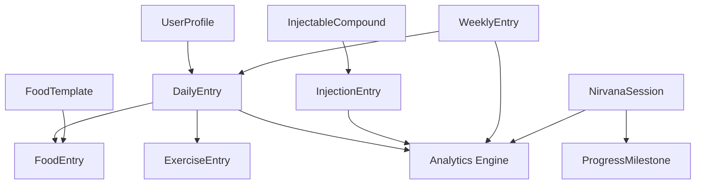

# MM Health Tracker Product Requirements Document (PRD)

## Goals and Background Context

### Goals
- Consolidate health tracking from 5-10 apps into a single integrated platform
- Provide real-time BMR-based calorie balance calculations throughout the day
- Enable cross-domain analytics to reveal correlations between health metrics
- Achieve sub-2-minute daily data entry for core health metrics
- Support specialized medical protocols with compound and ester tracking
- Integrate productivity metrics (MIT, deep work) with health tracking
- Deliver actionable insights through sophisticated analytics
- Establish foundation for future AI-powered recommendations

### Background Context

MM Health Tracker addresses the critical fragmentation problem in personal health management where users currently juggle multiple disconnected applications, leading to missed insights and tracking fatigue. By unifying nutrition tracking, exercise logging, medical protocol management, specialized training systems, and productivity tools into a single platform built on a BMR-based calculation engine, we enable users to discover meaningful correlations between different aspects of their health and performance. The localStorage-first architecture ensures instant responsiveness while maintaining data privacy, positioning this as the comprehensive solution for health optimization enthusiasts who demand both depth and integration in their tracking tools.

### Change Log

| Date | Version | Description | Author |
|------|---------|-------------|--------|
| 2024-12-28 | 1.0 | Initial PRD creation from Project Brief | PM |

## Requirements

### Functional

- FR1: The system shall calculate and display real-time BMR-based calorie balance using the Mifflin-St Jeor formula
- FR2: The system shall support daily entry of calories consumed, exercise performed, and weight measurements
- FR3: The system shall track macronutrients (protein, carbs, fats) with user-defined targets
- FR4: The system shall provide food templates and recent items for quick calorie entry
- FR5: The system shall calculate exercise calorie burn using MET values and duration
- FR6: The system shall support injectable compound tracking with ester calculations and weekly targets
- FR7: The system shall track Nirvana Life training sessions with customizable session types
- FR8: The system shall manage progress milestones and personal records for specialized training
- FR9: The system shall provide MIT (Most Important Tasks) planning with daily task management
- FR10: The system shall support weekly objectives with Monday planning and Friday review cycles
- FR11: The system shall track deep work session completion as binary daily metrics
- FR12: The system shall generate analytics showing correlations between different health metrics
- FR13: The system shall provide data export functionality in standard formats (CSV, JSON)
- FR14: The system shall maintain all data in localStorage with zero data loss
- FR15: The system shall auto-adjust BMR calculations based on weight changes

### Non Functional

- NFR1: All page loads and UI interactions must complete in under 3 seconds
- NFR2: The application must function fully offline after initial load
- NFR3: The system must support Chrome 90+, Safari 14+, Firefox 88+, Edge 90+ on desktop and mobile
- NFR4: Data entry for daily metrics must be completable in under 2 minutes
- NFR5: The application must maintain 60 FPS for all animations and transitions
- NFR6: localStorage usage must not exceed 10MB for typical user with 1 year of data
- NFR7: The system must ensure data consistency across all 47+ localStorage keys
- NFR8: All calculations must match established health app accuracy within 5%
- NFR9: The PWA must provide native-like experience on mobile devices
- NFR10: The application must be accessible at WCAG AA compliance level
- NFR11: Date handling must maintain consistency with YYYY-MM-DD format across all features
- NFR12: The system must support data migration path to future database backend
- NFR13: All monetary calculations must use integer cents to avoid floating-point errors
- NFR14: The application must maintain responsive design from 320px to 4K displays
- NFR15: Security must ensure no sensitive health data is exposed in browser logs or network requests

## User Interface Design Goals

### Overall UX Vision

Create a dashboard-centric experience where users can see their complete health picture at a glance, with progressive disclosure for detailed tracking. The interface should feel like a personal health command center, combining the simplicity of consumer apps with the depth of professional tools. Every interaction should reinforce the connection between different health aspects through visual cues and intelligent data presentation.

### Key Interaction Paradigms

- **Quick Entry Forms**: Modal-based data entry with smart defaults and recent items
- **Card-Based Layouts**: Consistent information hierarchy using the MM Design System cards
- **Real-Time Feedback**: Instant calculation updates as users enter data
- **Progressive Disclosure**: Summary views expand to detailed tracking interfaces
- **Cross-Domain Insights**: Visual indicators when correlations are detected
- **Gesture Support**: Swipe navigation between daily entries on mobile

### Core Screens and Views

- Daily Dashboard (primary landing)
- Calorie & Macro Tracking
- Exercise Logger
- Weight Trends
- Injectable Management
- Nirvana Training Sessions
- MIT Planner
- Weekly Objectives
- Analytics Hub
- Settings & Profile
- Quick Entry Modal
- Data Export Interface

### Accessibility: WCAG AA

Full keyboard navigation support, screen reader compatibility, high contrast mode, and focus indicators throughout the application. All interactive elements must meet minimum touch target sizes for mobile accessibility.

### Branding

Utilize the MM Design System with its signature mm-blue (#00A1FE) accent color, dark theme (mm-dark #1f1f1f), National2Condensed headings, and ESKlarheit body text. Maintain the 100px border radius for primary buttons and glass-card effects for data visualizations.

### Target Device and Platforms: Web Responsive

Primary focus on responsive web design that adapts from mobile (320px) through desktop (4K). Progressive Web App capabilities for mobile users with offline support and home screen installation.

## Technical Assumptions

### Repository Structure: Monorepo

Single repository containing the Next.js application, shared components, and future service modules. Structure: apps/ (web, future mobile), packages/ (shared, ui, utils), services/ (api, workers).

### Service Architecture

Start with Next.js monolithic architecture using API routes for backend logic. Design with clear domain boundaries to enable future microservices extraction. Use dependency injection patterns to facilitate testing and modularity.

### Testing Requirements

Unit tests for all calculation logic and storage operations. Integration tests for critical user flows. Manual testing convenience methods for localStorage inspection. Visual regression testing for key UI components. No E2E tests in MVP phase.

### Additional Technical Assumptions and Requests

- TypeScript strict mode enabled for type safety
- Tailwind CSS 4.0 with custom MM theme configuration
- React 19 with Server Components where beneficial
- localStorage as primary data store with migration path planned
- React Context + useReducer for state management
- Date-fns for all date manipulations maintaining YYYY-MM-DD format
- Recharts for data visualizations
- Progressive enhancement approach for JavaScript-dependent features
- No external analytics or tracking scripts for privacy
- Build-time optimization for minimal bundle size
- Environment-based configuration for API endpoints
- GitHub Actions for CI/CD pipeline
- Vercel deployment with preview environments

## Data Schema & Entity Definitions

### Core Data Entities

The application manages data through a structured localStorage approach with the following primary entities:

#### User Profile Entity
```typescript
interface UserProfile {
  id: string;
  name: string;
  email?: string;
  age: number;
  gender: 'male' | 'female' | 'other';
  height: number; // cm
  weight: number; // kg
  activityLevel: 'sedentary' | 'lightly_active' | 'moderately_active' | 'very_active' | 'extremely_active';
  bmr: number; // calculated
  tdee: number; // calculated
  calorieTarget: number;
  macroTargets: {
    protein: number; // grams
    carbs: number; // grams
    fats: number; // grams
  };
  units: 'metric' | 'imperial';
  createdAt: string; // YYYY-MM-DD
  updatedAt: string; // YYYY-MM-DD
}
```

#### Daily Entry Entity
```typescript
interface DailyEntry {
  date: string; // YYYY-MM-DD (primary key)
  weight?: number;
  calories: {
    consumed: number;
    burned: number;
    balance: number; // calculated
  };
  macros: {
    protein: number;
    carbs: number;
    fats: number;
  };
  foods: FoodEntry[];
  exercises: ExerciseEntry[];
  mit: {
    task1: { description: string; completed: boolean };
    task2: { description: string; completed: boolean };
    task3: { description: string; completed: boolean };
  };
  deepWork: boolean;
  notes?: string;
  createdAt: string; // ISO timestamp
  updatedAt: string; // ISO timestamp
}
```

#### Food Entry Entity
```typescript
interface FoodEntry {
  id: string;
  name: string;
  calories: number;
  macros: {
    protein: number;
    carbs: number;
    fats: number;
  };
  mealType: 'breakfast' | 'lunch' | 'dinner' | 'snack';
  timestamp: string; // ISO timestamp
  amount: number;
  unit: string;
}
```

#### Exercise Entry Entity
```typescript
interface ExerciseEntry {
  id: string;
  name: string;
  category: 'cardio' | 'strength' | 'sports' | 'daily_activities';
  metValue: number;
  duration: number; // minutes
  caloriesBurned: number; // calculated
  intensity: 'low' | 'moderate' | 'high';
  timestamp: string; // ISO timestamp
  notes?: string;
}
```

#### Injectable Compound Entity
```typescript
interface InjectableCompound {
  id: string;
  name: string;
  concentration: number; // mg/mL
  esterType: 'acetate' | 'propionate' | 'cypionate' | 'enanthate' | 'decanoate' | 'undecanoate';
  halfLife: number; // days
  category: 'trt' | 'hrt' | 'peptide' | 'other';
  weeklyTarget: number; // mg
  notes?: string;
  createdAt: string;
}
```

#### Injection Entry Entity
```typescript
interface InjectionEntry {
  id: string;
  compoundId: string;
  dose: number; // mg
  volume: number; // mL
  site: 'left_delt' | 'right_delt' | 'left_glute' | 'right_glute' | 'left_quad' | 'right_quad' | 'subq_abdomen' | 'subq_thigh';
  date: string; // YYYY-MM-DD
  timestamp: string; // ISO timestamp
  notes?: string;
}
```

#### Nirvana Session Entity
```typescript
interface NirvanaSession {
  id: string;
  date: string; // YYYY-MM-DD
  sessionType: string;
  duration: number; // minutes
  difficulty: 'beginner' | 'intermediate' | 'advanced';
  quality: 1 | 2 | 3 | 4 | 5; // stars
  exercises: string[];
  bodyParts: string[];
  notes?: string;
  timestamp: string; // ISO timestamp
}
```

#### Progress Milestone Entity
```typescript
interface ProgressMilestone {
  id: string;
  name: string;
  category: 'strength' | 'skill' | 'flexibility' | 'endurance';
  description: string;
  targetDate?: string; // YYYY-MM-DD
  completedDate?: string; // YYYY-MM-DD
  isCompleted: boolean;
  progress: number; // 0-100%
  notes?: string;
  createdAt: string;
}
```

#### Weekly Entry Entity
```typescript
interface WeeklyEntry {
  weekStart: string; // YYYY-MM-DD (Monday)
  objectives: {
    objective1: { description: string; completed: boolean };
    objective2: { description: string; completed: boolean };
    objective3: { description: string; completed: boolean };
  };
  review?: {
    completionRate: number;
    insights: string;
    nextWeekFocus: string;
    reviewDate: string; // YYYY-MM-DD (Friday)
  };
  createdAt: string;
  updatedAt: string;
}
```

#### Food Template Entity
```typescript
interface FoodTemplate {
  id: string;
  name: string;
  calories: number;
  macros: {
    protein: number;
    carbs: number;
    fats: number;
  };
  defaultAmount: number;
  defaultUnit: string;
  category: 'meal' | 'snack' | 'drink';
  isFavorite: boolean;
  usageCount: number;
  createdAt: string;
  lastUsed: string;
}
```

### localStorage Key Structure

The data entities map to localStorage keys using the following patterns:

#### Single Instance Data
- `mm-health-profile` → UserProfile
- `mm-macro-targets` → MacroTargets subset
- `mm-compounds` → InjectableCompound[]
- `mm-food-templates` → FoodTemplate[]
- `mm-nirvana-session-types` → NirvanaSessionType[]

#### Date-Based Data
- `mm-daily-entry-{YYYY-MM-DD}` → DailyEntry
- `mm-weekly-entry-{YYYY-MM-DD}` → WeeklyEntry (Monday date)
- `mm-nirvana-{YYYY-MM-DD}` → NirvanaSession[]

#### Specialized Collections
- `mm-injection-targets` → Weekly injection targets by compound
- `mm-nirvana-progress` → ProgressMilestone[]
- `mm-nirvana-body-mappings` → Session to body part correlations

### Data Relationships



### Data Migration Strategy

To support future database migration:

1. **Preserve Key Structure**: Date-based keys map directly to database composite keys
2. **Entity Integrity**: All entities include created/updated timestamps
3. **Relationship Mapping**: Foreign key relationships identified in interfaces
4. **Schema Versioning**: Include version field in UserProfile for migration tracking
5. **Export Format**: JSON structure directly maps to database schema

### Storage Constraints

- **Total Size Limit**: 10MB maximum for 1 year of data
- **Date Range**: Support 3+ years of historical data
- **Backup Strategy**: Export functionality preserves all relationships
- **Corruption Recovery**: Validate data structure on load with fallback defaults

## Epic List

Based on the 14 major features and MVP scope, I recommend structuring the development into 4 focused epics that deliver incremental value:

- **Epic 1: Foundation & Core Health Tracking** - Establish project infrastructure, user profiles with BMR calculations, daily dashboard, and basic calorie/weight tracking
- **Epic 2: Exercise & Nutrition Management** - Complete exercise logging with MET calculations, macro tracking, food templates, and meal categorization
- **Epic 3: Specialized Features & Medical Tracking** - Injectable compound management, MIT planning, weekly objectives, and deep work tracking
- **Epic 4: Analytics & Advanced Training** - Nirvana Life training system, progress milestones, comprehensive analytics, and data export functionality

## Epic 1: Foundation & Core Health Tracking

**Epic Goal**: Establish the foundational infrastructure and core health tracking capabilities that all other features will build upon. This epic delivers a functional health tracker with BMR-based calorie calculations, daily tracking dashboard, and essential data persistence using localStorage.

### Story 1.1: Project Setup and Infrastructure

As a developer,
I want to initialize the Next.js project with all necessary configurations,
so that we have a solid foundation for building the application.

#### Acceptance Criteria
1. Next.js 15.5+ project initialized with TypeScript 5 and App Router
2: Tailwind CSS 4.0 configured with MM Design System theme
3: ESLint and Prettier configured with consistent code style rules
4: Git repository initialized with proper .gitignore
5: Basic folder structure created (components/, lib/, types/, app/)
6: Package.json configured with necessary scripts (dev, build, lint)
7: Vercel deployment configured with preview environments
8: README.md with setup instructions and project overview

### Story 1.2: localStorage Storage Layer

As a developer,
I want to implement a robust localStorage abstraction layer,
so that all features can reliably persist and retrieve data.

#### Acceptance Criteria
1: Storage service with get/set/delete operations for all data types
2: Date serialization/deserialization handling YYYY-MM-DD format
3: SSR safety checks (typeof window !== 'undefined')
4: Error handling for quota exceeded and corrupted data
5: TypeScript interfaces for all storage data structures
6: Storage keys constants file with all 47+ keys defined
7: Debug utilities for localStorage inspection in development
8: Unit tests for all storage operations

### Story 1.3: User Profile Management

As a user,
I want to create and manage my health profile,
so that the app can calculate my personalized BMR and calorie targets.

#### Acceptance Criteria
1: Profile form with fields: age, gender, height, weight, activity level
2: BMR calculation using Mifflin-St Jeor formula
3: TDEE calculation based on activity multiplier
4: Profile data persisted to localStorage (mm-health-profile key)
5: Profile update triggers BMR recalculation
6: Form validation with appropriate error messages
7: Success confirmation after profile save
8: Profile data available throughout app via Context

### Story 1.4: Daily Dashboard Layout

As a user,
I want to see my daily health metrics in a unified dashboard,
so that I can track my progress at a glance.

#### Acceptance Criteria
1: Dashboard route at /daily with responsive layout
2: Card-based layout using MM Design System styles
3: Header showing current date with navigation to previous/next days
4: Calorie balance card showing consumed vs. target
5: Weight card with current weight and trend indicator
6: Exercise summary card (placeholder for now)
7: Quick entry button for adding new data
8: Mobile-responsive grid layout

### Story 1.5: Daily Calorie Tracking

As a user,
I want to log my daily calorie consumption,
so that I can monitor my caloric intake against my targets.

#### Acceptance Criteria
1: Modal form for calorie entry with amount and meal type
2: Meal types: Breakfast, Lunch, Dinner, Snacks
3: Running total of calories for the day
4: Visual progress bar showing calories vs. target
5: Calorie entries saved to localStorage (mm-daily-entry-{date})
6: Edit and delete functionality for existing entries
7: Real-time balance calculation (target - consumed)
8: Color-coded feedback (green=under, yellow=near, red=over target)

### Story 1.6: Weight Tracking

As a user,
I want to record my daily weight,
so that I can monitor trends over time.

#### Acceptance Criteria
1: Weight entry form in daily dashboard
2: Weight saved with current date to localStorage
3: Display of current weight with change from previous entry
4: 7-day moving average calculation
5: Trend indicator (up/down/stable)
6: Weight changes trigger BMR recalculation prompt
7: Validation for reasonable weight ranges
8: Unit support (lbs/kg) based on user preference

### Story 1.7: Basic Navigation and Layout

As a user,
I want to navigate between different sections of the app,
so that I can access all features easily.

#### Acceptance Criteria
1: Navigation bar with links to all major sections
2: Mobile hamburger menu for small screens
3: Active state indication for current page
4: Footer with version and basic info
5: Consistent layout wrapper for all pages
6: Loading states for data fetching
7: Error boundary for graceful error handling
8: 404 page for invalid routes

## Epic 2: Exercise & Nutrition Management

**Epic Goal**: Complete the nutrition and exercise tracking features with detailed macro management, exercise calorie calculations, and food templates for efficient data entry. This transforms the basic calorie tracker into a comprehensive nutrition and fitness management system.

### Story 2.1: Exercise Database and MET Values

As a developer,
I want to create an exercise database with MET values,
so that we can accurately calculate calorie burn for activities.

#### Acceptance Criteria
1: Exercise data structure with name, category, and MET value
2: Predefined list of common exercises with MET values
3: Categories: Cardio, Strength, Sports, Daily Activities
4: Search functionality for finding exercises
5: Ability to add custom exercises
6: MET to calorie calculation: (MET × weight in kg × duration in hours)
7: Storage of custom exercises in localStorage
8: TypeScript types for exercise data

### Story 2.2: Exercise Logging Interface

As a user,
I want to log my exercise sessions with duration and intensity,
so that I can track calories burned through activity.

#### Acceptance Criteria
1: Exercise entry form with exercise selection, duration, intensity
2: Quick-select for recent exercises
3: Calorie burn calculation displayed in real-time
4: Multiple exercises per day support
5: Exercise entries saved to daily entry in localStorage
6: Edit and delete functionality for exercises
7: Daily exercise summary on dashboard
8: Time input in minutes with conversion for calculations

### Story 2.3: Macro Nutrient Tracking

As a user,
I want to track my protein, carbohydrate, and fat intake,
so that I can manage my macronutrient ratios.

#### Acceptance Criteria
1: Macro entry fields (protein, carbs, fats) for each food entry
2: Automatic calorie calculation from macros (P×4 + C×4 + F×9)
3: Daily macro totals displayed on dashboard
4: Macro targets configuration in settings
5: Progress bars for each macro vs. target
6: Percentage breakdown of daily macros
7: Validation to ensure macro calories match total calories
8: Macro data saved with food entries in localStorage

### Story 2.4: Food Templates System

As a user,
I want to save frequently eaten meals as templates,
so that I can quickly log recurring meals.

#### Acceptance Criteria
1: Save current food entry as template with custom name
2: Template includes calories and all macro values
3: Templates list with search functionality
4: Apply template to quickly fill entry form
5: Edit and delete template functionality
6: Templates stored in localStorage (mm-food-templates)
7: Favorite templates for quick access
8: Template categories (meals, snacks, drinks)

### Story 2.5: Recent Foods Feature

As a user,
I want to quickly re-log recently eaten foods,
so that I can save time on repetitive entries.

#### Acceptance Criteria
1: Last 20 food entries stored as recent items
2: Recent foods displayed in entry modal
3: One-click to re-log a recent food
4: Ability to modify amount before saving
5: Recent items include name, calories, and macros
6: Clear recent foods option in settings
7: Smart ordering based on frequency and recency
8: Visual indicators for items logged today

### Story 2.6: Meal Categorization and Timing

As a user,
I want to categorize my food by meal and track eating times,
so that I can analyze my eating patterns.

#### Acceptance Criteria
1: Meal type selection for each food entry
2: Optional timestamp for when food was consumed
3: Default to current time with ability to modify
4: Meal-based grouping in daily view
5: Meal timing analytics (average meal times)
6: Intermittent fasting window tracking
7: Visual timeline of daily eating pattern
8: Meal categories: Breakfast, Lunch, Dinner, Snacks

### Story 2.7: Nutrition Summary Dashboard

As a user,
I want to see comprehensive nutrition analytics,
so that I can understand my dietary patterns.

#### Acceptance Criteria
1: Daily nutrition summary card with all metrics
2: Weekly average calculations for calories and macros
3: Adherence percentage to targets
4: Trend indicators for each metric
5: Calorie balance with exercise included
6: Net calories display (consumed - exercise)
7: Macro ratio pie chart
8: Quick stats: streak, best day, weekly average

## Epic 3: Specialized Features & Medical Tracking

**Epic Goal**: Implement specialized tracking features including injectable compound management for medical protocols, productivity integration with MIT planning and deep work tracking, and weekly objective management. These features differentiate MM Health Tracker from standard fitness apps.

### Story 3.1: Injectable Compound Registry

As a user,
I want to manage a list of injectable compounds with dosing information,
so that I can track my medical protocols accurately.

#### Acceptance Criteria
1: Compound entry form with name, concentration, ester type
2: Ester half-life calculations for common esters
3: Weekly target dosage configuration per compound
4: Compound list management (add, edit, delete)
5: Storage in localStorage (mm-compounds key)
6: Support for multiple compounds simultaneously
7: Compound categories (TRT, HRT, Peptides, Other)
8: Notes field for protocol details

### Story 3.2: Injection Tracking and Site Rotation

As a user,
I want to log my injections with site rotation tracking,
so that I can maintain proper injection practices.

#### Acceptance Criteria
1: Injection entry with compound, dose, date, site
2: Injection sites: Delts, Glutes, Quads, SubQ locations
3: Site rotation recommendations based on history
4: Visual body map showing recent injection sites
5: Daily injection entries in localStorage
6: Weekly adherence calculation vs. targets
7: Injection history view with filtering
8: Export capability for medical provider reports

### Story 3.3: MIT Planning System

As a user,
I want to plan my Most Important Tasks daily,
so that I can focus on high-priority activities.

#### Acceptance Criteria
1: MIT entry interface with 3 task slots
2: Task description and completion checkbox
3: Daily MIT planning prompt
4: Completion tracking as boolean per task
5: MIT history view showing completion rates
6: Integration with daily dashboard
7: MIT data in daily entry localStorage
8: Weekly MIT completion statistics

### Story 3.4: Deep Work Tracking

As a user,
I want to track my deep work sessions,
so that I can monitor my focused productivity.

#### Acceptance Criteria
1: Simple deep work completion toggle for each day
2: Optional session duration tracking
3: Deep work streak calculation
4: Weekly deep work frequency display
5: Integration with daily dashboard
6: Correlation analysis with health metrics
7: Deep work data in daily entry
8: Monthly deep work calendar view

### Story 3.5: Weekly Objectives Management

As a user,
I want to set and review weekly objectives,
so that I can maintain strategic focus.

#### Acceptance Criteria
1: Monday planning interface for 3 weekly objectives
2: Objective description and success criteria
3: Friday review interface with completion status
4: Week-over-week completion tracking
5: Weekly entry localStorage (mm-weekly-entry-{weekStart})
6: Objective categories (Health, Work, Personal)
7: Weekly review notifications
8: Historical objectives browser

### Story 3.6: Compound Dosage Calculator

As a user,
I want to calculate precise dosages based on concentration,
so that I can accurately measure my injectable compounds.

#### Acceptance Criteria
1: Calculator with concentration and desired dose inputs
2: Volume calculation in mL with syringe markings
3: Weekly total calculations based on frequency
4: Ester release calculations over time
5: Stack total calculations for multiple compounds
6: IU to mg conversions for peptides
7: Save calculation results to notes
8: Visual syringe representation of volume

### Story 3.7: Productivity Analytics

As a user,
I want to see analytics about my productivity metrics,
so that I can optimize my work patterns.

#### Acceptance Criteria
1: MIT completion rate over time
2: Deep work frequency and streaks
3: Weekly objective success rate
4: Correlation with health metrics (calories, sleep)
5: Best/worst productivity days analysis
6: Productivity score calculation
7: Trend analysis with recommendations
8: Export productivity data

## Epic 4: Analytics & Advanced Training

**Epic Goal**: Implement the Nirvana Life specialized training system with session tracking and progress milestones, plus comprehensive analytics that reveal insights across all tracked metrics. This epic transforms raw data into actionable intelligence.

### Story 4.1: Nirvana Life Session Types

As a developer,
I want to configure Nirvana Life training session types,
so that users can track specialized gymnastics and mobility work.

#### Acceptance Criteria
1: Predefined session types (Rings, Parallettes, Flexibility, etc.)
2: Session type data structure with name, category, focus areas
3: Custom session type creation
4: Session types stored in localStorage (mm-nirvana-session-types)
5: Session difficulty levels (Beginner, Intermediate, Advanced)
6: Body part mappings for each session type
7: Default session library with 20+ types
8: Icon or color coding for session categories

### Story 4.2: Nirvana Training Logger

As a user,
I want to log my Nirvana Life training sessions,
so that I can track my gymnastics and mobility progress.

#### Acceptance Criteria
1: Session entry with type, duration, difficulty, notes
2: Multiple sessions per day support
3: Session quality rating (1-5 stars)
4: Specific exercises/skills practiced
5: Session data saved to localStorage (mm-nirvana-{date})
6: Session history with filtering by type
7: Quick-log recent session types
8: Photo attachment capability (base64 in localStorage)

### Story 4.3: Progress Milestones System

As a user,
I want to track progress milestones in my training,
so that I can celebrate achievements and stay motivated.

#### Acceptance Criteria
1: Milestone creation with name, category, target date
2: Milestone categories (Strength, Skill, Flexibility, Endurance)
3: Milestone completion tracking with date achieved
4: Progress indicators for approaching milestones
5: Milestone storage (mm-nirvana-progress)
6: Achievement badges for completed milestones
7: Milestone sharing/export functionality
8: Suggested milestones based on training history

### Story 4.4: Personal Records Management

As a user,
I want to track personal records for exercises,
so that I can monitor my performance improvements.

#### Acceptance Criteria
1: PR entry with exercise, value, unit, date
2: PR categories matching training types
3: PR history with progression graphs
4: Automatic PR detection from logged sessions
5: PR notifications when records are broken
6: PR comparison with previous bests
7: Export PR data for external tracking
8: PR goals with target dates

### Story 4.5: Body Part Heat Mapping

As a user,
I want to see which body parts I'm training most frequently,
so that I can ensure balanced development.

#### Acceptance Criteria
1: Body diagram with heat map overlay
2: Training frequency calculation by body part
3: Session-to-body-part correlation engine
4: Weekly/monthly heat map views
5: Imbalance detection and alerts
6: Recommended sessions for underworked areas
7: Historical heat map comparisons
8: Muscle group categorization

### Story 4.6: Comprehensive Analytics Dashboard

As a user,
I want to see comprehensive analytics across all my tracked metrics,
so that I can discover patterns and optimize my health.

#### Acceptance Criteria
1: Multi-metric correlation analysis
2: 7/30/90 day trend views for all metrics
3: Best/worst day identification with factors
4: Predictive insights based on patterns
5: Custom date range selection
6: Metric comparison overlays
7: Statistical analysis (averages, std dev, trends)
8: Insight cards with actionable recommendations

### Story 4.7: Advanced Visualizations

As a user,
I want to see my data in various visualization formats,
so that I can better understand my patterns.

#### Acceptance Criteria
1: Line graphs for trends over time
2: Bar charts for daily/weekly comparisons
3: Pie charts for macro distributions
4: Heat calendars for consistency tracking
5: Scatter plots for correlation analysis
6: Radar charts for multi-metric balance
7: Interactive tooltips with details
8: Export charts as images

### Story 4.8: Data Export and Backup

As a user,
I want to export and backup all my data,
so that I can migrate to other systems or analyze externally.

#### Acceptance Criteria
1: Export all data as JSON with schema documentation
2: Export filtered data by date range
3: CSV export for spreadsheet analysis
4: Backup to file with timestamp
5: Import functionality for restoring data
6: Selective export by data type
7: Data validation on import
8: Automatic backup reminders

## Checklist Results Report

*[This section will be populated after running the PM checklist validation]*

## Next Steps

### UX Expert Prompt

Please review this PRD and create detailed UI/UX specifications for MM Health Tracker. Focus on the dashboard-centric design with card-based layouts using the MM Design System. Pay special attention to the quick-entry flows for daily metrics and the correlation visualization in analytics. Ensure all interfaces support sub-2-minute daily entry completion.

### Architect Prompt

Please create a comprehensive technical architecture document for MM Health Tracker based on this PRD. Focus on the localStorage-based data layer with 47+ keys, React Context state management, Next.js 15.5 App Router structure, and the BMR calculation engine. Design for future migration to PostgreSQL while maintaining current localStorage implementation. Ensure all components support offline-first PWA functionality.