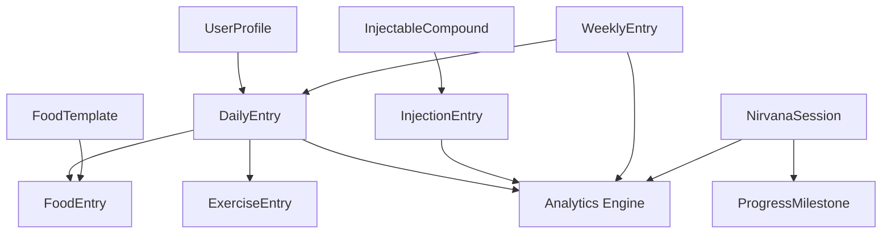

# Data Schema & Entity Definitions

## Core Data Entities

The application manages data through a structured localStorage approach with the following primary entities:

### User Profile Entity
```typescript
interface UserProfile {
  id: string;
  name: string;
  email?: string;
  age: number;
  gender: 'male' | 'female' | 'other';
  height: number; // cm
  weight: number; // kg
  activityLevel: 'sedentary' | 'lightly_active' | 'moderately_active' | 'very_active' | 'extremely_active';
  bmr: number; // calculated
  tdee: number; // calculated
  calorieTarget: number;
  macroTargets: {
    protein: number; // grams
    carbs: number; // grams
    fats: number; // grams
  };
  units: 'metric' | 'imperial';
  createdAt: string; // YYYY-MM-DD
  updatedAt: string; // YYYY-MM-DD
}
```

### Daily Entry Entity
```typescript
interface DailyEntry {
  date: string; // YYYY-MM-DD (primary key)
  weight?: number;
  calories: {
    consumed: number;
    burned: number;
    balance: number; // calculated
  };
  macros: {
    protein: number;
    carbs: number;
    fats: number;
  };
  foods: FoodEntry[];
  exercises: ExerciseEntry[];
  mit: {
    task1: { description: string; completed: boolean };
    task2: { description: string; completed: boolean };
    task3: { description: string; completed: boolean };
  };
  deepWork: boolean;
  notes?: string;
  createdAt: string; // ISO timestamp
  updatedAt: string; // ISO timestamp
}
```

### Food Entry Entity
```typescript
interface FoodEntry {
  id: string;
  name: string;
  calories: number;
  macros: {
    protein: number;
    carbs: number;
    fats: number;
  };
  mealType: 'breakfast' | 'lunch' | 'dinner' | 'snack';
  timestamp: string; // ISO timestamp
  amount: number;
  unit: string;
}
```

### Exercise Entry Entity
```typescript
interface ExerciseEntry {
  id: string;
  name: string;
  category: 'cardio' | 'strength' | 'sports' | 'daily_activities';
  metValue: number;
  duration: number; // minutes
  caloriesBurned: number; // calculated
  intensity: 'low' | 'moderate' | 'high';
  timestamp: string; // ISO timestamp
  notes?: string;
}
```

### Injectable Compound Entity
```typescript
interface InjectableCompound {
  id: string;
  name: string;
  concentration: number; // mg/mL
  esterType: 'acetate' | 'propionate' | 'cypionate' | 'enanthate' | 'decanoate' | 'undecanoate';
  halfLife: number; // days
  category: 'trt' | 'hrt' | 'peptide' | 'other';
  weeklyTarget: number; // mg
  notes?: string;
  createdAt: string;
}
```

### Injection Entry Entity
```typescript
interface InjectionEntry {
  id: string;
  compoundId: string;
  dose: number; // mg
  volume: number; // mL
  site: 'left_delt' | 'right_delt' | 'left_glute' | 'right_glute' | 'left_quad' | 'right_quad' | 'subq_abdomen' | 'subq_thigh';
  date: string; // YYYY-MM-DD
  timestamp: string; // ISO timestamp
  notes?: string;
}
```

### Nirvana Session Entity
```typescript
interface NirvanaSession {
  id: string;
  date: string; // YYYY-MM-DD
  sessionType: string;
  duration: number; // minutes
  difficulty: 'beginner' | 'intermediate' | 'advanced';
  quality: 1 | 2 | 3 | 4 | 5; // stars
  exercises: string[];
  bodyParts: string[];
  notes?: string;
  timestamp: string; // ISO timestamp
}
```

### Progress Milestone Entity
```typescript
interface ProgressMilestone {
  id: string;
  name: string;
  category: 'strength' | 'skill' | 'flexibility' | 'endurance';
  description: string;
  targetDate?: string; // YYYY-MM-DD
  completedDate?: string; // YYYY-MM-DD
  isCompleted: boolean;
  progress: number; // 0-100%
  notes?: string;
  createdAt: string;
}
```

### Weekly Entry Entity
```typescript
interface WeeklyEntry {
  weekStart: string; // YYYY-MM-DD (Monday)
  objectives: {
    objective1: { description: string; completed: boolean };
    objective2: { description: string; completed: boolean };
    objective3: { description: string; completed: boolean };
  };
  review?: {
    completionRate: number;
    insights: string;
    nextWeekFocus: string;
    reviewDate: string; // YYYY-MM-DD (Friday)
  };
  createdAt: string;
  updatedAt: string;
}
```

### Food Template Entity
```typescript
interface FoodTemplate {
  id: string;
  name: string;
  calories: number;
  macros: {
    protein: number;
    carbs: number;
    fats: number;
  };
  defaultAmount: number;
  defaultUnit: string;
  category: 'meal' | 'snack' | 'drink';
  isFavorite: boolean;
  usageCount: number;
  createdAt: string;
  lastUsed: string;
}
```

## localStorage Key Structure

The data entities map to localStorage keys using the following patterns:

### Single Instance Data
- `mm-health-profile` → UserProfile
- `mm-macro-targets` → MacroTargets subset
- `mm-compounds` → InjectableCompound[]
- `mm-food-templates` → FoodTemplate[]
- `mm-nirvana-session-types` → NirvanaSessionType[]

### Date-Based Data
- `mm-daily-entry-{YYYY-MM-DD}` → DailyEntry
- `mm-weekly-entry-{YYYY-MM-DD}` → WeeklyEntry (Monday date)
- `mm-nirvana-{YYYY-MM-DD}` → NirvanaSession[]

### Specialized Collections
- `mm-injection-targets` → Weekly injection targets by compound
- `mm-nirvana-progress` → ProgressMilestone[]
- `mm-nirvana-body-mappings` → Session to body part correlations

## Data Relationships



## Data Migration Strategy

To support future database migration:

1. **Preserve Key Structure**: Date-based keys map directly to database composite keys
2. **Entity Integrity**: All entities include created/updated timestamps
3. **Relationship Mapping**: Foreign key relationships identified in interfaces
4. **Schema Versioning**: Include version field in UserProfile for migration tracking
5. **Export Format**: JSON structure directly maps to database schema

## Storage Constraints

- **Total Size Limit**: 10MB maximum for 1 year of data
- **Date Range**: Support 3+ years of historical data
- **Backup Strategy**: Export functionality preserves all relationships
- **Corruption Recovery**: Validate data structure on load with fallback defaults